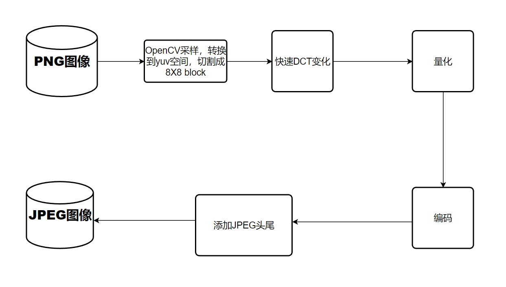
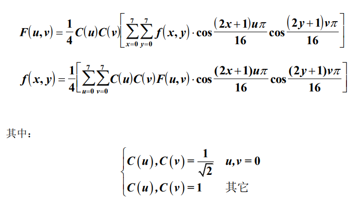
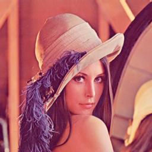

# JPEG 静图像压缩实验
* 周潮 PB19030889
---
## 一、实验目的
1. 了解数字图像压缩的一类方法。
2. 掌握2D快速DCT变换的算法。
## 二、实验环境
    python3.10
    bitstream
    cv2
    numpy

## 三、实验步骤
JEPG是常用图像压缩编码格式，PNG到JPEG转化过程如图。

### 1. 采样，映射，切割
本实验使用cv2获取各个像素点的RGB像素值，后映射到YUV空间。
$$
Y=0.299R+0.587G+0.114B-127 \\
U=0.148R-0.289G+0.473B \\
V=0.615R-0.515G-0.1B 
$$
最后将图像填充到8X8的倍数，方便进行8X8切割。

### 2. 快速DCT变化
DCT变化为：

可以改写成$F = AfA^T$的形式，其中$A_{ij}=C(i)cos[\frac{(j+0.5)i\pi}{8}]$
### 3. 量化
JPEG算法中，对Y分量和UV分量使用不同的量化表。但是由于实验讲义中只给了一个表，故我们在实验结果中会比较使用这两组不同表的差距。

### 4.编码
#### a. DC编码
DC系统编码的基本步骤为：
    1. 初值为0，对相邻块DC做差分编码；
    2. 对差分值的size做Huffman编码；
    3. 若差分值为正数，则编码为其二进制数；若差分值为负数，则编码为其二进制数后取反。
#### b. AC编码
AC系统编码的基本步骤为：
    1. 对块进行Z字形扫描；
    2. 将扫描结果改成(runlength,size)(amplitude)；
    3. 对(runlength,size)做Huffman编码，但对runlength>15的情况要额外处理。对amplitude做如DC系统的编码。

### 5. 添加JPEG头
JPEG文件包含了JPEG头，图像大小，量化表，Huffman编码，JPEG数据，JPEG尾等部分。这里我们参考了[添加JPEG头](https://github.com/EdVince/OpenCL_learning/blob/main/JPEG_python/jpeg_python.ipynb)中数据写入的操作。

### 四、实验结果
原图为

### 1. 初始状态设置 g_scale = 8
输出的jpg图像为
压缩比为$\frac{117KB}{12.2KB}=9.59$
### 2. 改变g_scale
1. g_scale = 0
   输出的jpg图像为
   压缩比为$\frac{117KB}{117KB}=1.0$
2. g_scale = 4
    输出的jpg图像为
   压缩比为$\frac{117KB}{25.7KB}=4.55$
3. g_scale = 16
    输出的jpg图像为
   压缩比为$\frac{117KB}{6.75KB}=17.33$
4.  g_scale = 64
    输出的jpg图像为
   压缩比为$\frac{117KB}{3.56KB}=32.86$

5. g_scale = 256
    输出的jpg图像为
   压缩比为$\frac{117KB}{2.83KB}=41.34$

可以发现，g_scale越高，压缩比越大，图像质量越低

### 3. 使用不同量化表
我们将单一的量化表换成Y量化表和UV量化表。
1. g_scale = 8
   1. 单一量化表
   输出的jpg图像为
压缩比为$\frac{117KB}{12.23KB}=9.59$
   2. 亮度色度量化表
      输出的jpg图像为
压缩比为$\frac{117KB}{10.3KB}=11.36$
2. g_scale = 64
   1. 单一量化表
   输出的jpg图像为
   压缩比为$\frac{117KB}{3.56KB}=32.86$
   2. 亮度色度量化表
      输出的jpg图像为
        压缩比为$\frac{117KB}{3.62KB}=11.36$

可以对比发现，使用单一量化表和亮度色度量化表区别不大。

### 4. DCT 变换，量化后，数据的值域是多少？有没有可能超出码表所给幅值的范围。 
   值域变为-2048 - 2047
   Huffman表最多给出了11位的编码，所以不会超过码表给出的范围